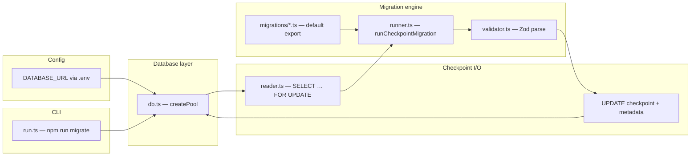

# AgentMigrate — architecture

This document describes how the **`Project-Setup`** branch is structured, how data flows at runtime, and how **Phase / Step** progress maps to the codebase. **Update this file whenever you complete a meaningful step or phase** (add a row to [Progress log](#progress-log) and adjust the sections that changed).

---

## Purpose

AgentMigrate is a **Node.js (TypeScript) tool** that connects to **PostgreSQL** (e.g. Supabase), reads **LangGraph-style checkpoint rows** from the `checkpoints` table, runs **versioned migrations** that transform **`checkpoint`** and **`metadata`** JSONB, validates outputs with **Zod**, and writes results back in a **single transaction** (commit all rows or roll back on failure).

---

## High-level diagram

---

## Data model (PostgreSQL)

The tool targets a **`checkpoints`** table compatible with typical LangGraph Postgres checkpointer usage:

| Column | Role |
|--------|------|
| `thread_id` | Row identity (with `checkpoint_ns`, `checkpoint_id`) |
| `checkpoint_ns` | Namespace segment |
| `checkpoint_id` | Checkpoint id |
| `parent_checkpoint_id` | Present on read; passed through only if your migration keeps it inside JSON |
| `checkpoint` | **JSONB** — primary migration surface |
| `metadata` | **JSONB** — validated and written together with `checkpoint` |

`runner.ts` updates with:

`WHERE thread_id = $3 AND checkpoint_ns = $4 AND checkpoint_id = $5`.

---

## Module map

| Path | Responsibility |
|------|----------------|
| `src/db.ts` | **`createPool()`** — reads **`DATABASE_URL`**, returns a **`pg` `Pool`** |
| `src/types.ts` | **`CheckpointRow`**, **`MigrationContext`**, **`MigratedCheckpointPayload`**, **`CheckpointMigration`** (async **`up`**, **`schema`**, **`id`**) |
| `src/reader.ts` | **`readCheckpointsForUpdate`** — loads all rows with **`FOR UPDATE`** inside the current transaction |
| `src/validator.ts` | **`validateMigratedPayload`** — **`schema.parse`** for each migrated payload |
| `src/rollback.ts` | **`rollbackTransaction`** — **`ROLLBACK`** on failure paths |
| `src/runner.ts` | **`runCheckpointMigration`** — `BEGIN` → read locked rows → each row: **`migration.up({ row })`** → Zod validate → second loop: **`UPDATE`** `checkpoint` + `metadata` → **`COMMIT`** or rollback |
| `migrations/*.ts` | Default export **`CheckpointMigration`** (example **`001_rename_field`** — renames keys in checkpoint JSON) |
| `src/run.ts` | CLI entry: **`createPool`**, **`runCheckpointMigration`** with the wired migration |

**Scripts:** **`npm run migrate`** and **`npm run dev`** run **`src/run.ts`**. **`npm run build`** emits **`dist/`** (layout per `tsconfig` **`rootDir: "."`**).

---

## Runtime flow (Project-Setup)

1. **`run.ts`** creates a pool, connects a client, and calls **`runCheckpointMigration(client, migration)`**.
2. Runner starts a transaction (**`BEGIN`**), then **`readCheckpointsForUpdate`** locks all checkpoint rows.
3. For each row, **`migration.up({ row })`** returns **`{ checkpoint, metadata }`** (or a Promise of it).
4. **`validateMigratedPayload`** enforces the migration’s Zod schema.
5. After every row passes validation, runner **`UPDATE`s** each row’s **`checkpoint`** and **`metadata`**.
6. **`COMMIT`** on success; on any error, **`rollbackTransaction`** and rethrow.

---

## Design choices (short)

- **Transactional all-or-nothing** — avoids partial writes across rows when something fails mid-run.
- **Row locking** — **`FOR UPDATE`** reduces concurrent writers conflicting during migration.
- **Zod at the boundary** — every migrated payload must match the migration’s schema before commit.
- **Migrations as modules** — default export **`CheckpointMigration`** with string **`id`** for logging.

---

## Progress log

_Add a row for each merged step (or phase milestone) you want reflected in the doc._

| Date | Phase | Step / milestone | Notes |
|------|-------|------------------|--------|
| 2026-04-06 | Project setup | Toolchain + changelog | `CHANGELOG.md`, Node 20 ESM, `pg` / `dotenv` / `zod`, `migrate` / `dev` scripts |
| 2026-04-07 | Project setup | Architecture doc | This file; aligns with `run.ts`, transactional runner, Zod validation |

---

## How to keep this file current

1. After merging a PR or finishing a step, add a **row** to [Progress log](#progress-log).
2. If new modules, tables, or flows appear, update **Module map**, **Runtime flow**, and/or **High-level diagram**.
3. When **`package.json`** scripts or env vars change, mention them here or in **`CHANGELOG.md`**.

---

## Related docs

- **`CHANGELOG.md`** — release-style notes and **Unreleased** bullets; update in parallel when behavior or tooling changes.
