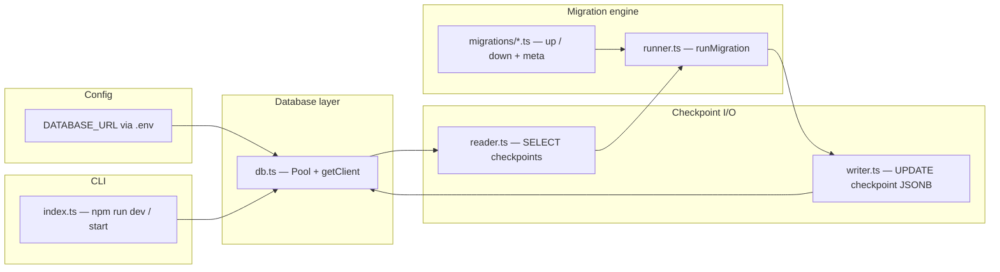

# AgentMigrate — architecture

This document describes how the repository is structured, how data flows at runtime, and how **Phase / Step** progress maps to the codebase. **Update this file whenever you complete a meaningful step or phase** (add a row to [Progress log](#progress-log) and adjust the sections that changed).

---

## Purpose

AgentMigrate is a **Node.js (TypeScript) tool** that connects to **PostgreSQL** (e.g. Supabase), reads **LangGraph-style checkpoint rows** from the `checkpoints` table, applies **pure migration functions** to the agent state held in JSON (`checkpoint` JSONB, specifically `channel_values`), and **writes the updated blob back** to the same row.

---

## High-level diagram

---

## Data model (PostgreSQL)

The tool assumes a table named **`checkpoints`** compatible with typical LangGraph Postgres checkpointer usage:

| Column | Role |
|--------|------|
| `thread_id` | Part of row identity |
| `checkpoint_ns` | Namespace segment of identity |
| `checkpoint_id` | Checkpoint id |
| `parent_checkpoint_id` | Read with each row; **not** updated by `writer.ts` (only the `checkpoint` JSONB column is written), so the column value is preserved unless changed elsewhere. |
| `checkpoint` | **JSONB** — full checkpoint object; migrations transform **`checkpoint.channel_values`**. |
| `metadata` | JSONB — read with the row; not rewritten by the current writer path. |

`writer.ts` updates with:

`WHERE thread_id = $2 AND checkpoint_ns = $3 AND checkpoint_id = $4`.

---

## Module map

| Path | Responsibility |
|------|----------------|
| `src/db.ts` | Loads `dotenv`, validates `DATABASE_URL`, exports shared **`pg` `Pool`** and **`getClient()`** |
| `src/reader.ts` | **`getAllCheckpoints`**, **`getCheckpointsByThread`** — maps rows to **`CheckpointRow`**; optional **`limit` / `offset`** for paging |
| `src/writer.ts` | **`updateCheckpointBlob`** — **`UPDATE checkpoints SET checkpoint = $1::jsonb`** |
| `src/runner.ts` | **`runMigration(client, rows, migrationFn, options?)`** — reads `channel_values`, runs **`migrationFn`**, merges back, persists, returns slim **`MigrationResult[]`**; optional **`logProgressEvery`** (default 100) |
| `migrations/*.ts` | **`meta`**, pure **`up` / `down`** on `Record<string, unknown>` state (e.g. **`001_rename_field.ts`**) |
| `src/index.ts` | CLI entry: **`getClient`**, **`getAllCheckpoints`**, **`runMigration(..., up)`**, prints summary |

**Build:** `tsc` emits **`dist/src/**`** and **`dist/migrations/**`**; **`npm start`** runs **`dist/src/index.js`**.

---

## Runtime flow (Phase 1)

1. **`index.ts`** obtains a client and loads checkpoints with **`getAllCheckpoints(client)`**.
2. For each row, **`runMigration`** clones **`channel_values`**, calls **`up(state)`**, builds **`nextCheckpoint`** with updated **`channel_values`**, and **`updateCheckpointBlob`** persists it.
3. Failures are recorded per row; the pool is released and ended in **`index.ts`**.

---

## Design choices (short)

- **Slim results** — `MigrationResult` stores ids and errors, not full state objects.
- **Immediate write** — Each successful transform is persisted before the next row.
- **Pure migrations** — `up` / `down` are plain functions for easy testing.

---

## Progress log

| Date | Phase | Step / milestone | Notes |
|------|-------|------------------|--------|
| 2026-04-06 | Project setup / docs | Changelog + architecture (initial) | Landed via PR #7; later revised to match Phase 1 code on `main`. |
| 2026-04-06 | Phase 1 | Core migration engine | `db`, `reader`, `runner`, `writer`, `index`, `001_rename_field`. |

---

## How to keep this file current

1. After merging a PR or finishing a step, add a **row** to [Progress log](#progress-log).
2. If modules or flows change, update **Module map**, **Runtime flow**, and/or the diagram.
3. Keep **`CHANGELOG.md`** in sync for user-facing changes.

---

## Related docs

- **`CHANGELOG.md`** — release-style notes and **Unreleased** bullets.
- **`README.md`** — product narrative and local setup.
